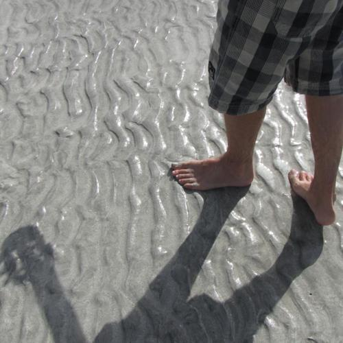

>[E Aí King? (2010)](https://onerpm.link/2492153310)

Neste primeiro disco, dei vazão a vários temas que me interessavam na época:

- **A importância de relacionamentos sinceros** — *Armadilhas*
- **Relacionamentos realistas** — *Canino*
- **Relacionamentos com tesão** — *Calor do Dia*
- **A busca pela atividade pessoal genuína** — *Bom Senso* e *Sol na Lata*
- **As dificuldades da vida adulta** — *Charles*, *Paz da Mordaça* e *Vô Caetano*
- **Pegação e afins** — *Me Chama de Hippie*, *O Homem Mais Bonito de Goianésia* e *Baile*

Escolhi vários estilos que me agradam, do rock ao reggae, do dancehall ao samba-rock, passando pelo ska e pelo funk carioca com guitarras distorcidas.

## A produção do disco

A capa mostra meus delicados pés numa praia em Maragogi, Alagoas, onde eu e minha esposa passamos a lua-de-mel.

Quis representar nessa foto o trabalho que tive no disco: compus todas as músicas, gravei e programei os instrumentos, além de cantar.

O disco foi mixado e masterizado por [Rafael Maranhão](https://www.instagram.com/maranhaotrampa/), no [Estúdio Madruga](https://www.estudiomadruga.com.br/), em Brasília, em setembro/outubro de 2010.

## Histórias por trás das músicas

### Calor do Dia

*Calor do Dia* não é totalmente original, mas uma livre versão — não exatamente igual — de uma música do Yellowman, [Love It](https://www.youtube.com/watch?v=27qQUDVQvn0).

Yellowman é um dos [grandes cantores do dancehall jamaicano da década de 80](http://en.wikipedia.org/wiki/Yellowman) e uma referência para muita gente. O 311, por exemplo, aproveitou o começo de uma música dele, [Mr. Chin](https://www.youtube.com/watch?v=zHBD6DJzUq4), em [All Mixed Up](http://www.youtube.com/watch?v=NPSBfIRVqJg).

A melodia de outra de suas músicas, [Zunguzungunguzunguzeng](https://www.youtube.com/watch?v=HV46OGU7ksE), foi basicamente reaproveitada em pelo menos 14 músicas diferentes, como mostra [esse artigo muito interessante](http://wayneandwax.com/?p=137).

Aqui no Brasil, ele é mais conhecido por 2 menções do Planet Hemp na música <a href="http://www.youtube.com/watch?v=P-W2JmG9vtQ">Mantenha o Respeito</a>: [_Nobody move, nobody get hurt_](https://www.youtube.com/watch?v=0g73fhu8TAg), _ninguém se move, ninguém se machucará_ e _Eu ouço **Yellow**, Buju Banton, Cutty Ranks, Shabba, >porque eles não querem me impedir de fazer fumaça_. 

Eu sempre me amarrei em Yellowman, especialmente na melodia do refrão de *Love It*. Mas o resto da letra era bem tosco, então a re-adaptei para algo mais... palatável.

### Charles

*Charles* é da época em que eu tocava no [Grajaú 434](https://music.youtube.com/watch?v=TuVL_QTbhhg) e foi uma das primeiras músicas feitas com a banda.

Para o disco, dei uma repaginada nela, mudando algumas partes da letra e várias partes da base.

### Bom Senso

*Bom Senso* é uma espécie de:

> “Jorge Ben e seu violão foram passar férias na Jamaica, escutaram dancehall e chaparam o coco, voltaram pro Brasil, chamaram o Trio Mocotó pra colocarem uns apitos e pandeiros e gravaram o que deu na telha.”

### Paz da Mordaça

*Paz da Mordaça* fala sobre ser uma pessoa normal, com seus desejos comuns e necessidades universais, em meio a um grupo de pessoas que conscientemente incentiva sua loucura.

Governantes, marketeiros, publicitários, jornalistas e super-artistas que não fazem arte alguma. Pessoas que vendem ilusões de grandeza, desinformação e necessidades supérfluas.

A música começou como um reggae bem roots, por causa da linha de baixo.

Como achei que faltava alguma *cosita a más*, coloquei uma batida meio hip hop e acrescentei teclados e guitarras sem qualquer parcimônia.

A segunda parte continuava no reggae roots. Então acelerei o andamento e coloquei uma batida meio cumbia/reggaeton/dancehall — ou sei lá o quê.

As frequências graves do baixo foram obtidas diretamente do centro da Terra, ou da linha interestelar de Alfa Centauri, ou da barriga da minha mãe. Um desses aí.

### Sol na Lata

*Sol na Lata* começou como um rock básico, com bateria bem reta e guitarras pesadas.

Depois resolvi colocar uma bateria eletrônica no estilo do [Asian Dub Foundation](https://www.youtube.com/channel/UCPoeHrAk4hofTF6oZ1IWqOw).

A música fala sobre aquele momento na vida em que você **sabe o que tem que fazer**.

Se é que ele existe, hehehe.

### O Homem Mais Bonito de Goianésia

Um funk rock com guitarra pesada e violão, em homenagem à malandragem do pegador mais efetivo do Planalto Central.

### Baile

Um funk pancadão com guitarras distorcidas, algo meio [Comunidade Nin-Jitsu](https://www.youtube.com/c/ComunidadeNinJitsu).

### Canino

*Canino* é uma homenagem à minha esposa.

Se só ela entender a letra, já tá bom demais.

### Vô Caetano

*Vô Caetano* é uma ode à vida de eterno quebrado que tanto conhecemos.

Independente de estado civil, formação acadêmica, time de coração ou orientação sexual, a gente paga contas.

É isso.

## O que esse disco representa

Esse disco foi o meu **cartão de visitas**, mostrando a mistureba de sons que me agradam.

E me orgulho muito de ter conseguido fazê-lo.

Aprendi muito com ele sobre **gravação, composição e sobre o efeito que uma letra pode ter sobre amigos, familiares e ouvintes**.

## Videoclipe de "Bom Senso"

> [E Ai King - Bom Senso (2011)](https://www.youtube.com/watch?v=-7PD0tLPXcI)

Também lancei um video clipe da música de trabalho do primeiro disco, E Aí King?, gravado em Novembro de 2010, em Maragogi, Alagoas. Dancehall com samba rock sobre encontrar seu caminho num mundo caótico e cheio de informação.

## Referências

A playlist associada ao disco reúne algumas das músicas que usei como referência para compor e gravar cada faixa.

<iframe data-testid="embed-iframe" style="border-radius:12px" src="https://open.spotify.com/embed/playlist/4YtEvZiEMx3xbsofDmb4q8?utm_source=generator&si=3893c035aa334973" width="100%" height="152" frameBorder="0" allowfullscreen="" allow="autoplay; clipboard-write; encrypted-media; fullscreen; picture-in-picture" loading="lazy"></iframe>