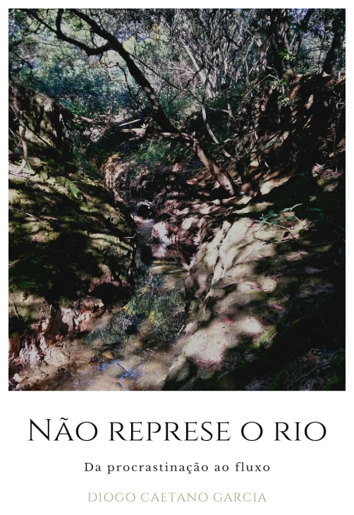

>[Não Represe o Rio (2022)](https://onerpm.link/128350492054)

_Não Represe o Rio_ é meu terceiro disco, e meu predileto. Além de disco, ele virou o livro [Não Represe o Rio: da Procrastinação ao Fluxo](https://www.amazon.com.br/N%C3%A3o-Represe-Rio-procrastina%C3%A7%C3%A3o-fluxo-ebook/dp/B0B9YN5DK5). Ambos nasceram da minha digestão de tudo o que aconteceu na pandemia de covid-19, especialmente comigo mesmo:

> Uma pandemia mundial, três doses de ayahuasca, muita terapia e um violão. O amanhã ninguém sabe, mas existem amanhãs e AMANHÃS.

> Em janeiro de 2020, eu estava na minha praia baiana predileta curtindo a água morna e a família branda, enquanto notícias chinesas apontavam para um beco sem saída e um desvio muito fora do desvio-padrão.

> Em fevereiro de 2020, nosso carnaval era pontuado pela dúvida: já chegou o coronavírus nesse bacanal, nadando de braçada na muvuca e na esbórnia?

> Em março de 2020, ele chegou com o pé na porta e um murro no baço, mas a gente sabia que daqui a duas semanas tudo se resolveria.

> Eu já estava fazendo trabalho de sombra meses antes do mundo inteiro, pendurado de cabeça pra baixo e tentando me conciliar com quem eu sou. O Santo Daime deu-me um espelho para olhar, e quanto mais eu fugia, mais a sombra me seguia.

> E nesse contexto nasceu esse disco.

## A produção do disco

O título _Não Represe o Rio_ surgiu por conta do córrego do Parque Olhos D’água, em Brasília, onde fiz muitas sessões de terapia à distância, e também tive vários insights após minhas corridas.

Um dia, eu estava na beirada do córrego pensando sobre minhas dúvidas em lançar as músicas que havia composto, quando percebi que o rio não se apega à corrente, e que eu as estava represando, bem como meus sentimentos e sonhos.

A capa é uma foto que tirei do córrego.

### _Tracklist_

- **E Aí King, Tudo Certo** — Samba rock de abertura do disco, falando sobre meu amor à música.
- **Calçada na Beira do Mar** — Um samba rock com guitarras distorcidas (Jorge Ben + 311) sobre uma belíssima moça passeando pelo calçadão de Ipanema.
- **Era uma Vez um Clichê** — Um reggae no estilo Sublime sobre seguir (ou não) nossos sonhos na vida.
- **Juiz** — Um punk rock sobre as cobranças que a vida nos impõe por não andarmos juntos com a verdade.
- **Alumiô, É Pêia** — Minha experiência com a ayahuasca no Santo Daime.
- **Se Liga, Meu Velho** — Uma música sobre a importância do autocuidado.
- **A Régua de Ouro** — Fala sobre a regra de ouro, como ela funciona (semelhante a um espelho), e como ela funciona como uma régua para medirmos os outros e nós mesmos.
- **Maya** — Música sobre filhos, realidade e ilusões.
- **Sonhando em Sua Companhia** — Música sobre a crença em vida após a morte, e na felicidade do reencontro com quem já perdemos.
- **O Viajante** — Letra sobre um [exercício vedanta do mestre Mooji](https://www.youtube.com/watch?v=wa5IF7x-ziA), onde o participante é convidado a largar suas bagagens da vida para poder descansar junto ao mestre em busca de paz.
- **Vou Ali Ouvir o Rio** — Música instrumental que homenageia o córrego do Parque Olhos D’água (de onde boa parte da inspiração do disco veio) e o livro Sidarta, de Hermann Hesse.

### O livro

[)(https://www.amazon.com.br/N%C3%A3o-Represe-Rio-procrastina%C3%A7%C3%A3o-fluxo-ebook/dp/B0B9YN5DK5)

O livro que acompanha o disco, [Não Represe o Rio: da Procrastinação ao Fluxo](https://www.amazon.com.br/N%C3%A3o-Represe-Rio-procrastina%C3%A7%C3%A3o-fluxo-ebook/dp/B0B9YN5DK5), dá mais detalhes do meu processo de terapia e cura, acompanhando cada música e seus significados pessoais.

### Videoclipe de "Sonhando em Sua Companhia"

> [E Ai King - Sonhando em Sua Companhia (2023)](https://www.youtube.com/watch?v=YYGAHIA1fZE)

Além do disco e do livro, lancei o [videoclipe de "Sonhando em Sua Companhia"](https://www.youtube.com/watch?v=Pqxpqldl9KE), gravado em expedição na Baía de Ilha Grande em 2 de março de 2023. É uma música sobre a crença em vida após a morte, e na felicidade do reencontro com quem já perdemos.

## Referências

A playlist associada ao disco reúne algumas das músicas que usei como referência para compor e gravar cada faixa.

<iframe data-testid="embed-iframe" style="border-radius:12px" src="https://open.spotify.com/embed/playlist/14G7LD6Bcm32BF6QBTQyFM?utm_source=generator&si=2d4623d1c5a94839" width="100%" height="152" frameBorder="0" allowfullscreen="" allow="autoplay; clipboard-write; encrypted-media; fullscreen; picture-in-picture" loading="lazy"></iframe>