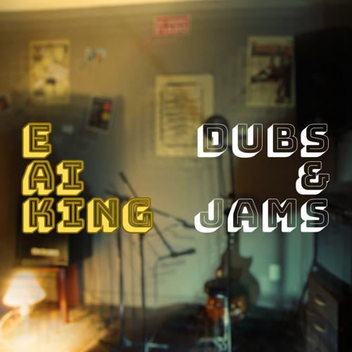

>[Dubs & Jams (2023)](https://onerpm.link/625015263852)

Em 2023, lancei **Dubs & Jams**, inspirado nos discos [The In Sound From Way Out!](https://open.spotify.com/intl-pt/album/0nA01XOVBUoi1zDVVYKz4i) dos Beastie Boys, [I & I Survived – Dub](https://open.spotify.com/intl-pt/album/0Gm1JBgQzsiLKIiLuP7x8w) dos Bad Brains, e [Dreaming From an Iron Gate](https://open.spotify.com/intl-pt/album/7FQLR8rbdw5zx73xipEQRb) de Groundation e Brain Damage.

Esse disco conta com uma música nova e versões instrumentais de músicas minhas já lançadas.

### _Tracklist_

- **Dub Pills** – reggae e dub em inglês, em ritmo de valsa, sobre o poder psicodélico da música, só que sem efeitos colaterais e nem questões éticas.
- **Bom Senso Dub** – versão dub de “Bom Senso” (E Aí King?, 2010).
- **Atraso Jam** – versão instrumental de “Atraso” (Co-Labs Volume 1, 2021).
- **O Viajante do Dub** – versão dub de “O Viajante” (Não Represe o Rio, 2022).
- **Paco Dub** – versão dub inspirada nas parcerias com Paco.
- **A Jam Mais Bonita de Goianésia** – versão instrumental de “O Homem Mais Bonito de Goianésia” (E Aí King?, 2010).
- **A Régua de Dub** – versão dub de “A Régua de Ouro” (Não Represe o Rio, 2022).

### Videoclipe de "Dub Pills"

> [E Ai King - Dub Pills (2024)](https://www.youtube.com/watch?v=Pqxpqldl9KE)

Além do disco, lancei o videoclipe de Dub Pills, gravado inteiramente na casa da vó da minha esposa com meu celular, procurando a psicodelia diária nos móveis, paredes, portas e plantas.

A joaninha pousando no meu braço enquanto eu filmava foi uma sincronicidade das mais felizes.

## Referências

A playlist associada ao disco reúne algumas das músicas que usei como referência para compor e gravar cada faixa.

<iframe data-testid="embed-iframe" style="border-radius:12px" src="https://open.spotify.com/embed/playlist/3kTkxQ8rO65jkQYhQnFLoW?utm_source=generator&si=51a8063ca85f448d" width="100%" height="152" frameBorder="0" allowfullscreen="" allow="autoplay; clipboard-write; encrypted-media; fullscreen; picture-in-picture" loading="lazy"></iframe>