[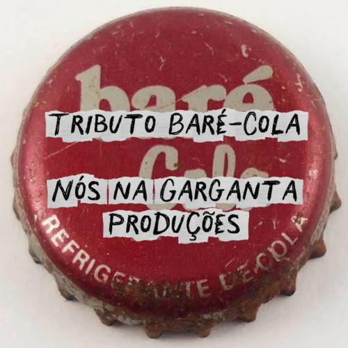]([https://youtube.com/playlist?list=PLS6NF350A-ZJE6ii0FR5VGrgQkurSJMin&si=tj3wtg5boKEVjPFJ)
>[Co-Labs Volume 2 - Tributo Baré-Cola (2026)](https://onerpm.link/2492153310)

Em 2025/26, produzi o **Co-Labs Volume 2 - Tributo Baré-Cola**: uma homenagem às bandas que definiram a cena de rock de Brasília nos anos 90, a chamada ["Geração Baré-Cola"](https://www.youtube.com/@geracaobare-cola5773).

<!--
|  |  |
|---|---|
|  | Em 2025/26, produzi o [Tributo Baré-Cola](https://youtube.com/playlist?list=PLS6NF350A-ZJE6ii0FR5VGrgQkurSJMin&si=tj3wtg5boKEVjPFJ): uma homenagem às bandas que definiram a cena de rock de Brasília nos anos 90, a chamada ["Geração Baré-Cola"](https://www.youtube.com/@geracaobare-cola5773). | -->

<!-- |  | Em 2025/26, produzi o [Tributo Baré-Cola](https://youtube.com/playlist?list=PLS6NF350A-ZJE6ii0FR5VGrgQkurSJMin&si=tj3wtg5boKEVjPFJ): uma homenagem às bandas que definiram a cena de rock de Brasília nos anos 90, a chamada ["Geração Baré-Cola"](https://www.youtube.com/@geracaobare-cola5773). | -->

<!--<iframe width="560" height="315" src="https://www.youtube.com/embed/videoseries?si=s7juJN1vuNKLUFBC&amp;list=PLS6NF350A-ZJE6ii0FR5VGrgQkurSJMin" title="YouTube video player" frameborder="0" allow="accelerometer; autoplay; clipboard-write; encrypted-media; gyroscope; picture-in-picture; web-share" referrerpolicy="strict-origin-when-cross-origin" allowfullscreen></iframe>-->

<!-- <iframe width="560" height="315" src="https://www.youtube.com/embed/videoseries?list=PLS6NF350A-ZJE6ii0FR5VGrgQkurSJMin" title="Tributo Baré-Cola" frameborder="0" allow="accelerometer; autoplay; clipboard-write; encrypted-media; gyroscope; picture-in-picture; web-share" referrerpolicy="strict-origin-when-cross-origin" allowfullscreen></iframe> -->

A ideia nasceu simples: usar o efeito de rede entre artistas para dar fôlego novo a essas músicas, convidando outros músicos a gravar em cima de uma pré-produção que eu preparava faixa a faixa, cada instrumento em trilha separada. Entraram no projeto releituras de: 

<!--Em 2025/26, produzi o [Tributo Baré-Cola](https://youtube.com/playlist?list=PLS6NF350A-ZJE6ii0FR5VGrgQkurSJMin&si=tj3wtg5boKEVjPFJ): uma homenagem às bandas que definiram a cena de rock de Brasília nos anos 90, a chamada ["Geração Baré-Cola"](https://www.youtube.com/@geracaobare-cola5773). A ideia nasceu simples: usar o efeito de rede entre artistas para dar fôlego novo a essas músicas, convidando outros músicos a gravar em cima de uma pré-produção que eu preparava faixa a faixa, cada instrumento em trilha separada. Entraram no projeto releituras de:-->

|  |  |
|---|---|
| 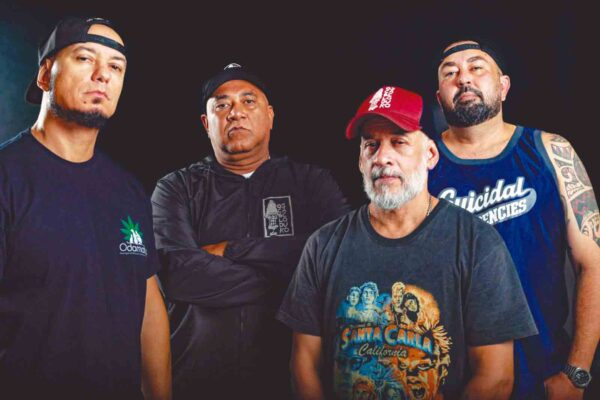 | **Os Cabeloduro:** "A Barca" e "Na Mesma Moeda" |
| 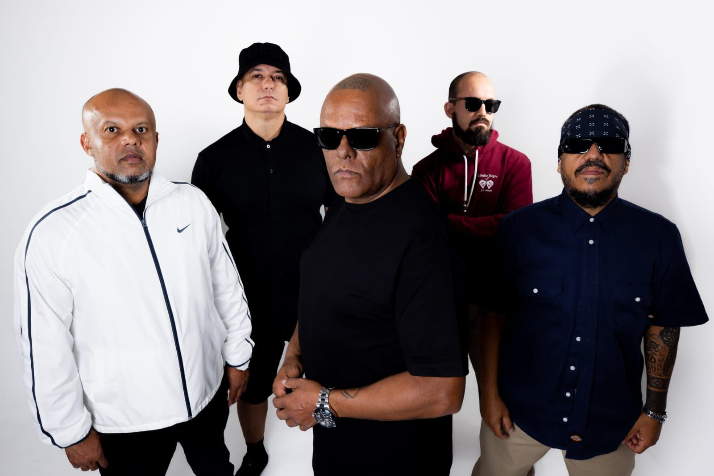 | **Câmbio Negro:** "Esse É Meu País" |
| 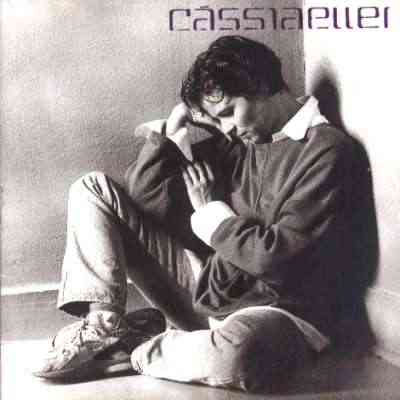 | **Cássia Eller:** "Malandragem" |
| 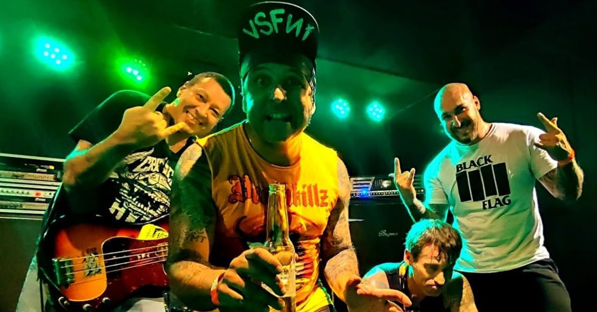 | **DFC:** "Molecada 666" e "Religião" |
| 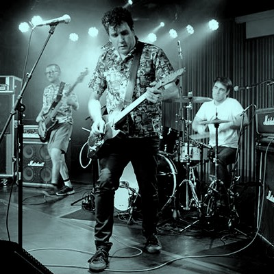 | **Little Quail and the Mad Birds:** "Azarar na W3" e "Dezesseis" |
| 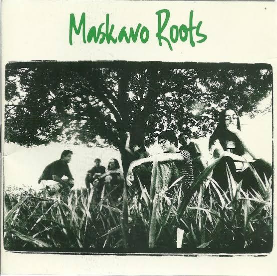 | **Maskavo Roots:** "Tempestade" e "45" |
| 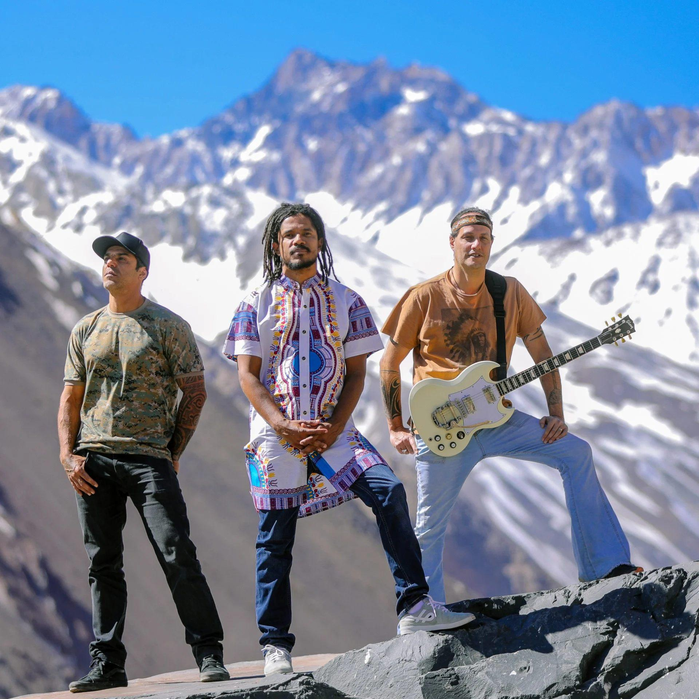 | **Natiruts:** "Reggae de Raiz" |
| 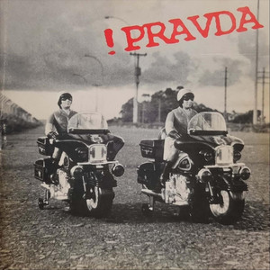 | **Pravda:** "66" |
| 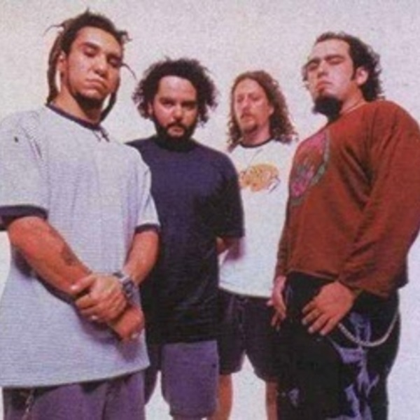 | **Raimundos:** "Eu Quero Ver o Oco / Herbocinética", "Puteiro em João Pessoa" e "Rapante" |
| 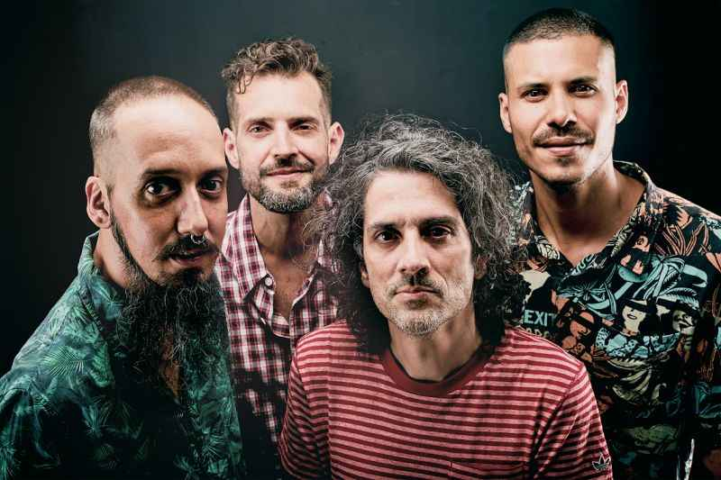 | **Rumbora:** "Chapirous" e "Querendo" |

<!-- |  |  |
|---|---|
|  | **Os Cabeloduro:** "A Barca" e "Na Mesma Moeda" |
|  | **Câmbio Negro:** "Esse É Meu País" |
|  | **Cássia Eller:** "Malandragem" |
|  | **DFC:** "Molecada 666" e "Religião" |
|  | **Little Quail and the Mad Birds:** "Azarar na W3" e "Dezesseis" |
|  | **Maskavo Roots:** "Tempestade" e "45" |
|  | **Natiruts:** "Reggae de Raiz" |
|  | **Pravda:** "66" |
|  | **Raimundos:** "Eu Quero Ver o Oco / Herbocinética", "Puteiro em João Pessoa" e "Rapante" |
|  | **Rumbora:** "Chapirous" e "Querendo" | -->

O critério foi sempre se inspirar no original, homenagear a música acrescentando algo novo, sem descaracterizar o som em relação à versão que todo mundo conhece.

## Videoclipes

**E Ai King & DJ SOIA - Eu Quero Ver o Oco / Herbocinética:** video do *Co-Labs Vol. 2 - Tributo Baré-Cola*. Mashup do DJ SOIA para as pedradas *Eu Quero Ver o Oco* e *Herbocinética*, do segundo disco do Raimundos, *Lavô Tá Novo*.

**E Ai King - 45:** video do *Co-Labs Vol. 2 - Tributo Baré-Cola*. Versão dubzada de *45*, do primeiro disco do Maskavo Roots de 1995, em parceria com [Renê Cosac Daher](https://www.instagram.com/daherrenecosac) na seleção de discos e livros.

**E Ai King & Brasa Tchecov - Reggae de Raiz:** video do *Co-Labs Vol. 2 - Tributo Baré-Cola*, uma versão de *Reggae de Raiz*, do primeiro disco do Natiruts de 1996, em parceria com [Brasa Tchecov](https://www.instagram.com/andrei_brasa_tchecov) nos vocais (oitava baixa) e cavaquinho wah-wahzado.

