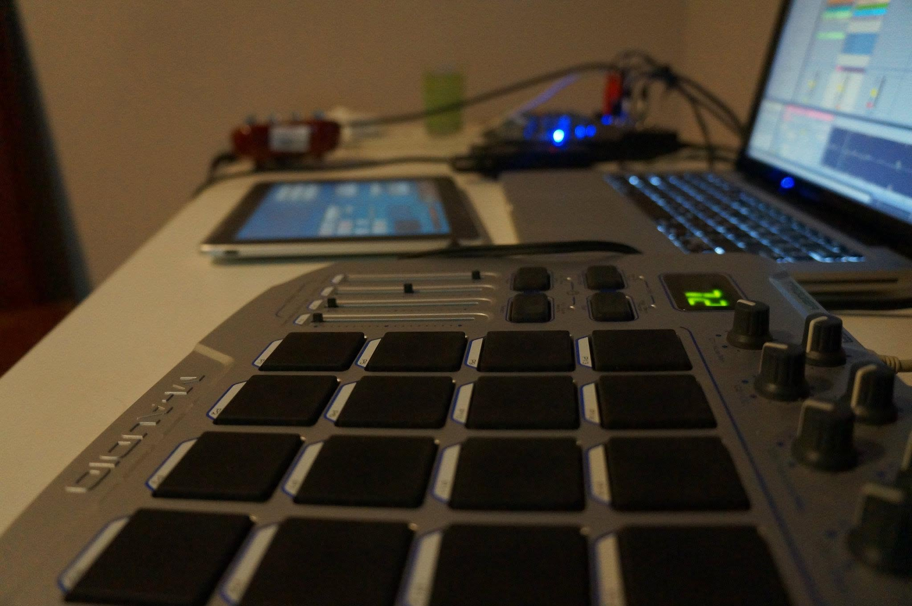
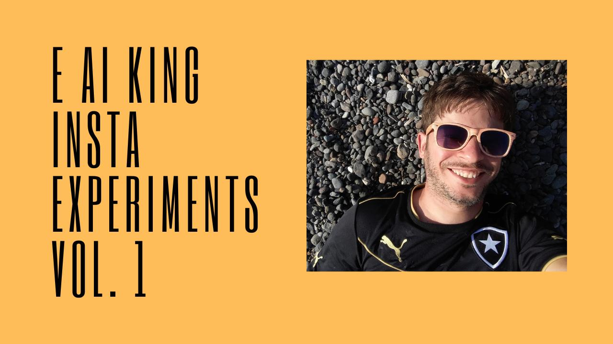

1. [Mashups](#mashups)
2. [Insta Experiments](#insta-experiments)
3. [Playlists](#playlists)

## Mashups

|   |   |
|---|---|
| | [Mashups](https://www.youtube.com/playlist?list=PLS6NF350A-ZLqrCYTOCw28ZGrdv4IFgib): guitarras, batidas e refrões emprestados, recombinados até virar outra coisa. Às vezes a graça está em pegar duas coisas que não deveriam se encontrar e ver o que surge. |

## Insta Experiments

|   |   |
|---|---|
| | [Insta Experiments](https://www.youtube.com/playlist?list=PLS6NF350A-ZJWt8zjqGFBWZMMxmJqNJWh) são covers diversos lançados no Instagram (Red Hot Chili Peppers, Bad Brains, 311, Seeed, Dr. Dre, 50 Cent, Michael Jackson, Beatles, Nirvana, dentre outros) |

## Playlists

_Mixtapes_ misturando E Ai King, inspirações e referências.

<iframe data-testid="embed-iframe" style="border-radius:12px" src="https://open.spotify.com/embed/playlist/3kTkxQ8rO65jkQYhQnFLoW?utm_source=generator&si=51a8063ca85f448d" width="100%" height="152" frameBorder="0" allowfullscreen="" allow="autoplay; clipboard-write; encrypted-media; fullscreen; picture-in-picture" loading="lazy"></iframe>

<iframe data-testid="embed-iframe" style="border-radius:12px" src="https://open.spotify.com/embed/playlist/14G7LD6Bcm32BF6QBTQyFM?utm_source=generator&si=2d4623d1c5a94839" width="100%" height="152" frameBorder="0" allowfullscreen="" allow="autoplay; clipboard-write; encrypted-media; fullscreen; picture-in-picture" loading="lazy"></iframe>

<iframe data-testid="embed-iframe" style="border-radius:12px" src="https://open.spotify.com/embed/playlist/4eyHb24701kdsEQs3KieEB?utm_source=generator&si=1d273aa35adf4a43" width="100%" height="152" frameBorder="0" allowfullscreen="" allow="autoplay; clipboard-write; encrypted-media; fullscreen; picture-in-picture" loading="lazy"></iframe>

<iframe data-testid="embed-iframe" style="border-radius:12px" src="https://open.spotify.com/embed/playlist/4YtEvZiEMx3xbsofDmb4q8?utm_source=generator&si=3893c035aa334973" width="100%" height="152" frameBorder="0" allowfullscreen="" allow="autoplay; clipboard-write; encrypted-media; fullscreen; picture-in-picture" loading="lazy"></iframe>

<iframe data-testid="embed-iframe" style="border-radius:12px" src="https://open.spotify.com/embed/playlist/0YDRCdM992y13rY4N797H9?utm_source=generator&si=8735dbf4ab3241da" width="100%" height="152" frameBorder="0" allowfullscreen="" allow="autoplay; clipboard-write; encrypted-media; fullscreen; picture-in-picture" loading="lazy"></iframe>

<iframe data-testid="embed-iframe" style="border-radius:12px" src="https://open.spotify.com/embed/playlist/5k9e1onMFHRbZ4kSRwC42x?utm_source=generator&si=3c906fb66e5c48de" width="100%" height="152" frameBorder="0" allowfullscreen="" allow="autoplay; clipboard-write; encrypted-media; fullscreen; picture-in-picture" loading="lazy"></iframe>

<iframe data-testid="embed-iframe" style="border-radius:12px" src="https://open.spotify.com/embed/playlist/6wBTqMCOD8mH3kAHapvjjo?utm_source=generator&si=14b22160cc3c4676" width="100%" height="152" frameBorder="0" allowfullscreen="" allow="autoplay; clipboard-write; encrypted-media; fullscreen; picture-in-picture" loading="lazy"></iframe>

<iframe data-testid="embed-iframe" style="border-radius:12px" src="https://open.spotify.com/embed/playlist/2OqC73M4tYKrNe2jc9HhrT?utm_source=generator&si=bf44f36222f44747" width="100%" height="152" frameBorder="0" allowfullscreen="" allow="autoplay; clipboard-write; encrypted-media; fullscreen; picture-in-picture" loading="lazy"></iframe>

<!--Nem tudo que é gravado vira faixa de disco. Aqui ficam os restos bons: versões, gravações de ensaio, ideias que não couberam em nenhum álbum.

## Faixas soltas

- **Demo — "Sem Pressa"** (2021), gravada num domingo de manhã, guitarra e voz só
- **Versão dub de "Rio Abaixo"**, feita pro *Dubs & Jams* e cortada na mixagem final
- Um cover de Tim Maia que nunca saiu do rascunho

> Lado B não é sobra. É o que não deu tempo de virar disco ainda.

## Como ouvir

As faixas avulsas vão sendo publicadas aos poucos no [SoundCloud](#) — sem data fixa, sem pressa, do jeito que sempre foi.
-->
