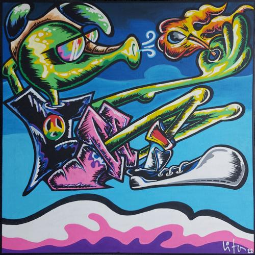

>[Brasil-lia (2023)](https://onerpm.link/172882780400)

Em **Brasil-lia**, faço um retrato bem-humorado e crítico de Brasília, falando dos temas típicos (arquitetura planejada, o Cerrado, a seca etc.), e ao mesmo tempo brinco com os contrastes de Brasília: uma cidade jovem, moderna e cheia de sonhos, mas também marcada pela política, pelos vícios do poder e por um certo paradoxo entre progresso e retrocesso.

No fundo, é uma homenagem ao **candango**, que se adapta, encara a seca, atravessa o planalto e continua seguindo em frente. Porque Brasília pode até ser uma cidade diferente de todas as outras, mas, de alguma forma, **ela tem a nossa cara**.

## A produção

> [Conversa com Shaka (2011)](https://www.youtube.com/watch?v=v9dXUTCfEPQ)

Além da música **Brasil-lia**, convidei o artista visual Vitor Bellini ([Shaka](https://www.instagram.com/voafuselo)) para criar uma capa que dialogasse com a música. Neste vídeo, a gente conversa sobre esse processo e sobre a nossa relação com Brasília.

No video acima, falamos sobre a identidade da cidade, o Cerrado, os Candangos e a mistura de pessoas e histórias que torna Brasília tão particular. Também entramos em questões mais pessoais sobre criação, pandemia, meditação, terapia e a importância de estar presente no momento.

No fim, a conversa é também uma celebração da parceria e da nossa tentativa de traduzir, cada um à sua maneira, um pouco do que é viver e criar em Brasília.